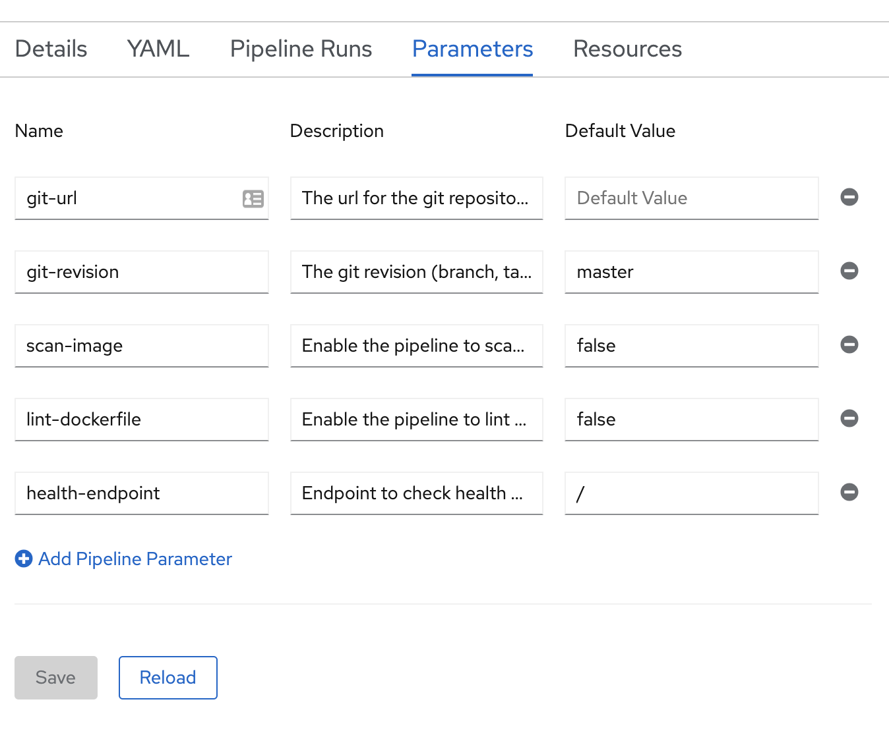
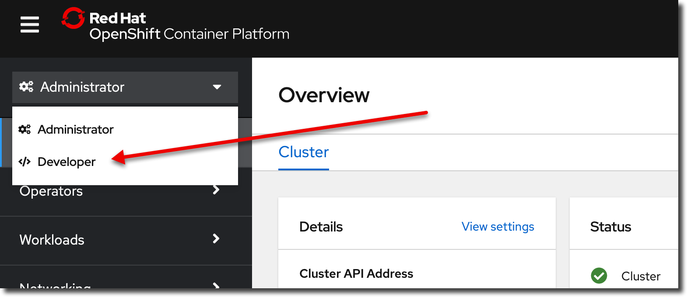

# CI with Tekton

## Go into your react-intro application

```
cd ~/react-intro
```

## Make sure that tests pass

Run the following command:

```
CI=true npm test
```

🛑 - You should see that all of your tests pass. If all of your tests don't pass, do not continue. Fix your tests.

## Make sure your code is on Gogs

Run the following command:

```
git status
```

You should have no changes to commit. If you have changes to commit.

```
git push origin master
```

### Log Into the cluster

```java
icc <cluster name>
```

For example: `icc cohort7`

### Create the Tekton Pipeline

Use the following instructions to set up a new continuous integration pipeline using Tekton.

1. In the repo folder run `oc pipeline --tekton`. This will create a new pipeline and add the application to the gitops repository `qa` environment.
   - `Select the Pipeline to use in the Pipeline Run:` choose the most appropriate pipeline for your project
     - For React, choose `ibm-nodejs`
     - For Go, choose `ibm-general`
   - `Image scan (y/n)`, type `n`
   - `Lint dockerfile (y/n)`, type `n`
1. If successful, the Pipeline Run URL is printed out. CMD+click on the URL to open in your default browser and see if the pipeline passes or fails.

> If the pipeline fails, use the troubleshooting tables below to fix the failure.

## Pipeline failures

You'll see the most errors the first time you are setting up the pipeline.

**test stage**

| Error Message        | Solution                                                                |
| -------------------- | ----------------------------------------------------------------------- |
| The test stage fails | Run the following command locally and fix any errors `CI=true npm test` |

NOTE: if you want to ignore a failing test (just so you can move onto the next stage during class) you can change `test` to `test.skip`

**build stage**

| Error Message                                                                                     | Solution                                                                                                                                                    |
| ------------------------------------------------------------------------------------------------- | ----------------------------------------------------------------------------------------------------------------------------------------------------------- |
| error reading info about "/source/Dockerfile": stat /source/Dockerfile: no such file or directory | [Containerize the application](../react/docker.md)                                                                                                          |
| The build stage fails                                                                             | Run the following command locally and fix any errors `docker build -t <application-name> .` Replace `<application-name>` with the correct application name. |

**deploy stage**

| Error Message                                                     | Solution                                                                                                                                                                                                                                                                                                                             |
| ----------------------------------------------------------------- | ------------------------------------------------------------------------------------------------------------------------------------------------------------------------------------------------------------------------------------------------------------------------------------------------------------------------------------ |
| cp: can't create directory '/<directory-name>': Permission denied | [Add helm charts](../helm) <br> render locally with `helm template <release-name> ./chart/base` where `<release-name>` is the name of your application in all lower case.                                                                                                                                                            |
| error: deployment "react-intro" exceeded its progress deadline    | This means the pods never came up. If you login to the project from terminal and run `oc get pods`, look for the pod that is failing (it will not be named using the pipeline run). You should see at least one that is not running. Then `oc describe pod <pod-name>` and/or `oc logs <pod-name>` to find out why it is not running |
| `error: object has been deleted`                                  | The namespace or Argo project name is the same as your repository name. Delete the namespace or Argo project and recreate it with a new unique name.                                                                                                                                                                                 |

**dockerfile-lint stage**

| Error Message               | Solution                                                                          |
| --------------------------- | --------------------------------------------------------------------------------- |
| dockerfile-lint stage fails | Set `lint-dockerfile` to `false` in the pipeline parameters (see the image below) |

**img-scan stage**

| Error Message            | Solution                                                                     |
| ------------------------ | ---------------------------------------------------------------------------- |
| The img-scan stage fails | Set `scan-image` to `false` in the pipeline parameters (see the image below) |

**health stage**

| Error Message                            | Solution                                                                      |
| ---------------------------------------- | ----------------------------------------------------------------------------- |
| contains `https://` in the error message | Add a `health-protocol` key with a value of `http` to the pipeline parameters |

**tag-release stage**

| Error Message          | Solution                                                                                                                                                                                                               |
| ---------------------- | ---------------------------------------------------------------------------------------------------------------------------------------------------------------------------------------------------------------------- |
| The tag already exists | delete the tag on origin by running `git push --delete origin <tag-name>` where `[tag-name>` is replaced with the conflicting tag value. Then delete the tag locally, if it exists, by running `git tag -d <tag-name>` |

**helm-release stage**

| Error Message                                                | Solution                                                                                                 |
| ------------------------------------------------------------ | -------------------------------------------------------------------------------------------------------- |
| It looks like your Artifactory installation is not complete. | Instructor should follow setup instructions at <https://cloudnativetoolkit.dev/admin/artifactory-setup/> |

## Other failures

| Error Message                                               | Solution                                                                                                                                                                                                                                 |
| ----------------------------------------------------------- | ---------------------------------------------------------------------------------------------------------------------------------------------------------------------------------------------------------------------------------------- |
| Pod with a status of ErrImagePull or ImagePullBackOff.      | `oc describe pod <pod-name>` to verify status - Add an [ImagePullSecret](https://kubernetes.io/docs/tasks/configure-pod-container/pull-image-private-registry/) for the private registry.                                                |
| Container does not run, crashes, or other application error | Diagnose pod issues by looking at the logs: <br> `oc get pod`<br> `oc describe pod <pod-name>`<br> `oc logs <pod-name>`<br> `oc logs <pod-name> -f` <- streams the logs<br> <br> Or run locally: `docker build ...` then `docker run...` |

## Pipeline parameters

The following is a screen shot of the pipeline parameters page:



## Finding your pipeline

1. Select developer view
   
1. Select pipelines
   
1. Filter projects by name
   
