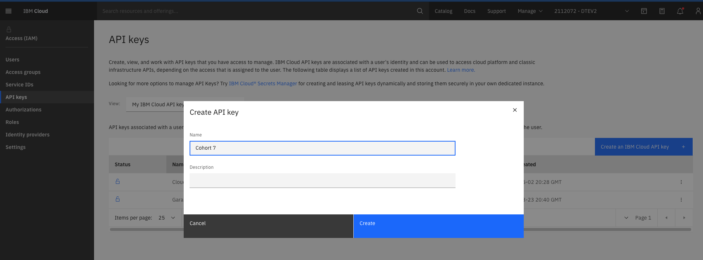

# IBM Cloud Setup

---

### PLEASE READ CAREFULLY!

Don't just copy/paste every command without reading

---

> **Note for Windows Users:** You'll run all of these commands from Ubuntu (WSL)

## Install the `ibmcloud` CLI

Do you already have `ibmcloud` installed?

```
which ibmcloud
```

If you see output like `/usr/local/bin/ibmcloud` then you have successfully installed it.

If you see output like `not found` then you need to install it:

1. Visit https://cloud.ibm.com/docs/cli?topic=cli-install-ibmcloud-cli
1. Follow the instructions for your operating system.
   > Tip: You can use the shell script in the second section instead of the installer option.

## Install the `ibmcloud` container plugin

Do you have the container plugin?

```
ibmcloud plugin list
```

You should see `container-service` in the list of plugins.

If you do not see `container-service` then do the following:

1. Visit https://cloud.ibm.com/docs/containers?topic=containers-cs_cli_install
1. Follow the instructions
   > At the time of this writing it's `ibmcloud plugin install container-service`

## Install required dependencies

```
brew install yq@3
echo "export PATH=\"$(brew --prefix yq@3)/bin:$PATH\"" >> ~/.zshrc
brew install jq
```

## Install the toolkit developer tools

1. Visit https://cloudnativetoolkit.dev/getting-started/dev-env-setup
1. Follow instructions. At the time of this writing, the commands are:
   ```
   curl -sL shell.cloudnativetoolkit.dev | bash -
   source ~/.zshrc
   ```

After installing this, the following commands should all print a path:

```
which igc
which tkn
which oc
```

## Verifying OC Plugins

When you run `oc plugin list` you should see several lines, including one with `kubectl-pipeline`.

If not, it's likely that your npm bin directory is not in your path.

If you installed Node via NVM, this might work:

```
nvm alias default node
```

If you installed Node with the installer, this might work:

```
echo "export PATH=\"\${HOME}/.npm/bin:\\${PATH}\"" >> ~/.zshrc
source ~/.zshrc
```

Then run `oc plugin list` again.

## Get an API Key

---

**NOTE** If you are installing tools before class starts, the cluster below might not be created yet, so skip these steps

---

1. Log into https://cloud.ibm.com with your IBM email address
1. ‼️ Make sure that "DTEV2" is selected from the account menu (see below)
1. Click on Manage > Access (IAM)
1. Under "My IBM Cloud API keys" click "View all"
1. Click "Create an IBM Cloud API key"
1. Enter a name and create the key
1. Download the key to your computer (if you don't, you'll have to create another one)





## Login to `ibmcloud`

In order to test that your account works, login using your API key.

Replace `YOUR_API_KEY` with your actual API key and then run this command:

```
ibmcloud login --apikey YOUR_API_KEY -r us-south
```

Run `ibmcloud ks clusters` to see the list of clusters you can access.

> NOTE: if you are following these instructions before class starts, the cluster list might be empty, and that's OK.

You should see your cohort's cluster in the list.

If you don't, it could be because:

1. It's before class started, and we haven't created it yet
1. You created your API key in the wrong account (your personal account, as opposed to DTEV2)
1. You have not been granted access to the cluster - contact your instructor

## Access the OpenShift Cluster

In order to login to the cluster from the command line, you must first log in on the website.

1. Log into https://cloud.ibm.com with your IBM email address
1. Make sure that "DTEV2" is selected from the account menu
1. Under "Resource Summary" click "Clusters"
1. Click your cohort's cluster
1. Click "OpenShift Web Console"
1. You should see the OpenShift web console


## (Optional) Configure ICC - fast cluster switcher

1. Run `icc --add-account`
1. name the account `garage`
1. Paste in the API key you generated above
1. Run `icc --generate`

When you run `icc` you should see at least one cluster listed (the cluster for your cohort).

When you run `icc <cluster name>` you should not see an error message.
