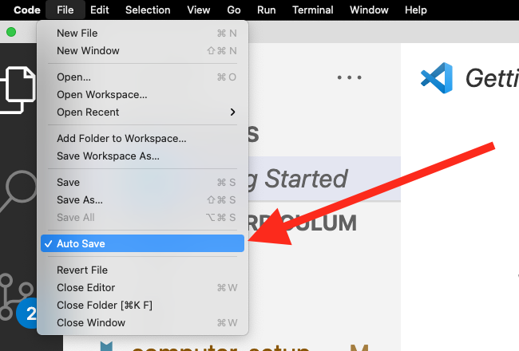

# Computer Setup

## VSCode

### Install (Mac)

Follow [these instructions](https://code.visualstudio.com/docs/setup/mac) on Mac.

**How do I know if I completed this step?**

Open Terminal and run the following command:

```
ls "/Applications/Visual Studio Code.app"
```

It's installed correctly if you see:

```
Contents
```

If you don't see the word `Contents`, that means it's not installed correctly. Drag it to your `Applications` folder.


### Install the `code` command line tool

Follow [these instructions](https://code.visualstudio.com/docs/setup/mac) on Mac.

**How do I know if I completed this step?**

1. Open a new Terminal window or tab
1. Type `which code`

It's installed correctly if you see something like:

```
/usr/local/bin/code
```

It's not installed correctly if you see something like:

```
code not found
```

### Enable Autosave

[Turn on Autosave](https://code.visualstudio.com/docs/editor/codebasics#_save-auto-save)

**How do I know if I completed this step?**

When you open the File menu, you should see that Autosave is checked.


